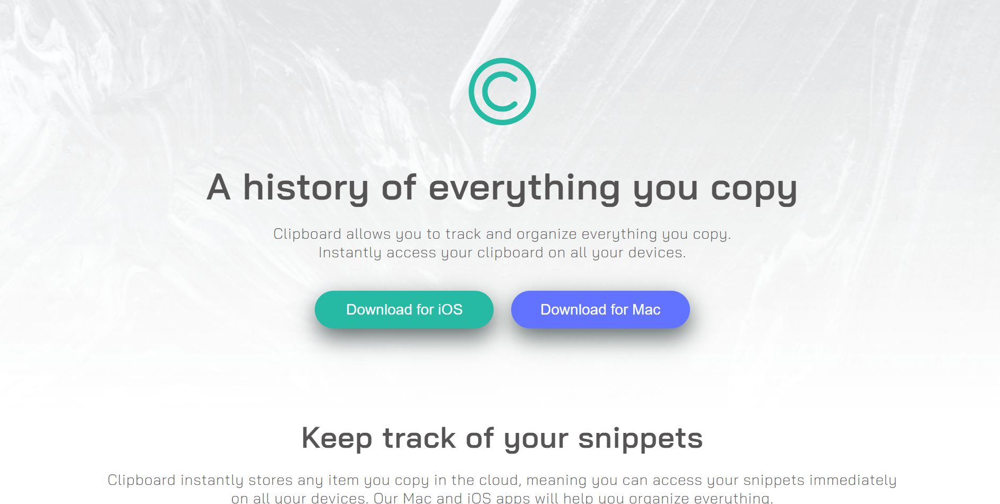
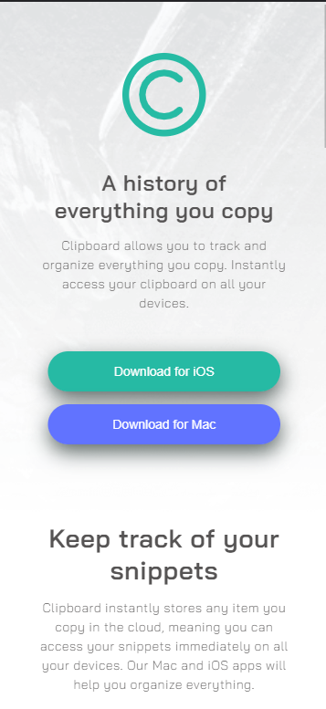

# Frontend Mentor - Clipboard-landing-page  solution

This is a solution to the Clipboard-landing-page master challenge Frontend Mentor challenges help you improve your coding skills by building realistic projects. 

### Link

- Live Site URL: [Clipboard live site](https://wizzy-design.github.io/clipboard-landing-page-master/)

### Screenshot

## My process

### Built with

- Semantic HTML5 markup
- CSS custom properties
- Flexbox

## Author

- Website - [Wisdom Ochei](https://wizzy-design.github.io/wisdom_portfolio/)
- Twitter - [@WisdomOchei](https://www.twitter.com/WisdomOchei)
